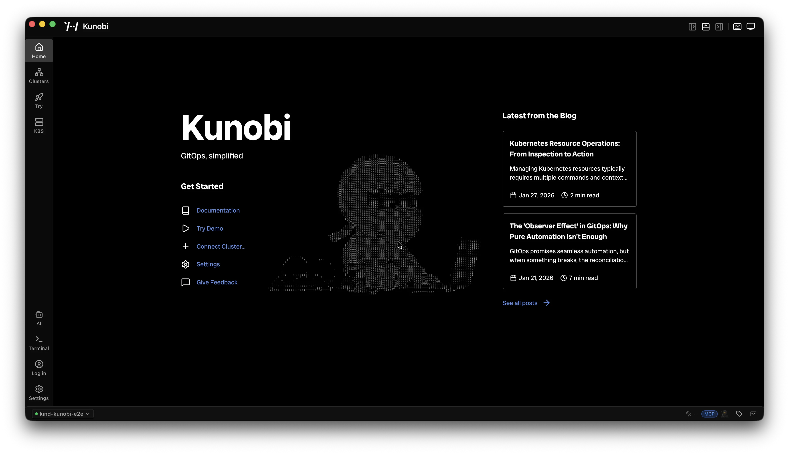
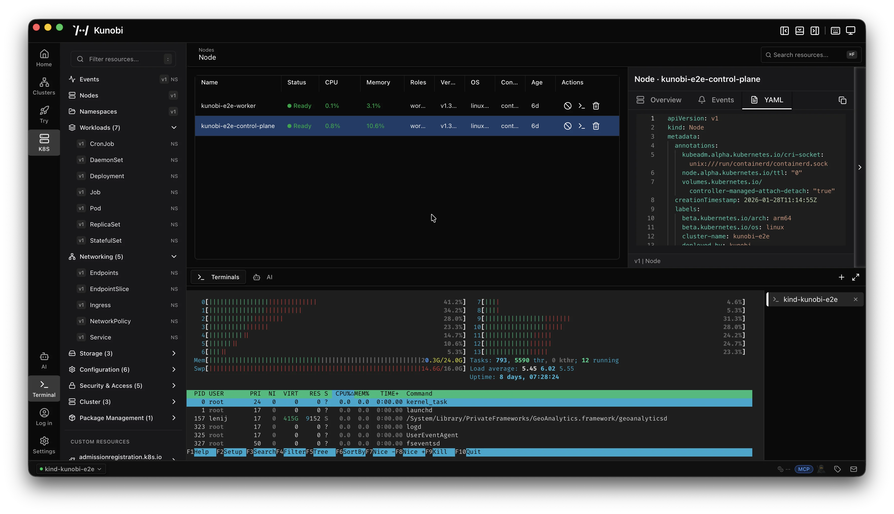
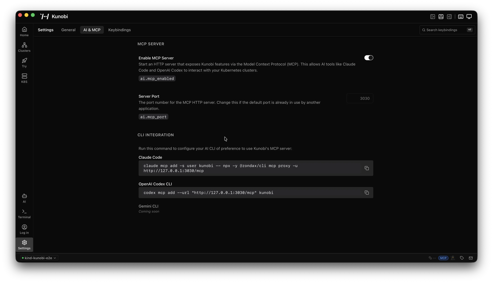

# @kunobi/mcp

MCP bridge to [Kunobi](https://kunobi.ninja), a desktop platform management IDE. AI assistants manage Kubernetes, FluxCD, ArgoCD, and Helm while users maintain real-time visual oversight.



## What is Kunobi?

[Kunobi](https://kunobi.ninja) is a desktop IDE for platform engineering — built with Rust and React, no Electron.

- Real-time cluster visibility with resource browser, YAML editor, and embedded terminal
- Native FluxCD, ArgoCD, and Helm support
- Built-in MCP server for AI assistants (Claude Code, OpenAI Codex CLI, Gemini CLI)
- Available on macOS, Windows, and Linux
- No account required, no cloud dependency



## How it works

This package runs as a stdio server and connects to Kunobi's built-in HTTP MCP endpoint to expose its tools to AI assistants.

```
AI assistant <--stdio--> @kunobi/mcp <--HTTP--> Kunobi (port 3030)
```

- **Always available:** `kunobi_status` — reports whether Kunobi is installed, running, and reachable
- **Dynamic:** When Kunobi is running with MCP enabled, its tools (`app_info`, `query_store`, `list_stores`, etc.) appear automatically via `notifications/tools/list_changed`
- **Auto-reconnect:** If Kunobi is stopped or restarted, tools disappear and reappear without restarting the MCP server

## Setup

Enable MCP in Kunobi under **Settings > AI & MCP**, then add the server to your AI assistant:



### Claude Code

```json
{
  "mcpServers": {
    "kunobi": {
      "command": "npx",
      "args": ["@kunobi/mcp"]
    }
  }
}
```

### Claude Desktop

```json
{
  "mcpServers": {
    "kunobi": {
      "command": "npx",
      "args": ["-y", "@kunobi/mcp"]
    }
  }
}
```

### OpenAI Codex CLI

```bash
codex mcp add --url "http://127.0.0.1:3030/mcp" kunobi
```

### Gemini CLI

```json
{
  "mcpServers": {
    "kunobi": {
      "command": "npx",
      "args": ["-y", "@kunobi/mcp"]
    }
  }
}
```

## Configuration (optional)

| Env var | Default | Description |
|---------|---------|-------------|
| `KUNOBI_MCP_URL` | `http://127.0.0.1:3030/mcp` | Override Kunobi's MCP HTTP endpoint |

No configuration is required. The server connects to Kunobi's default local endpoint automatically.

## Development

```bash
pnpm install
pnpm build
pnpm test
```

For local development against `@kunobi/mcp-bundler`:

```bash
pnpm dev:link    # link local bundler
pnpm dev:unlink  # revert to npm version
```

## License

[Apache-2.0](LICENSE)
