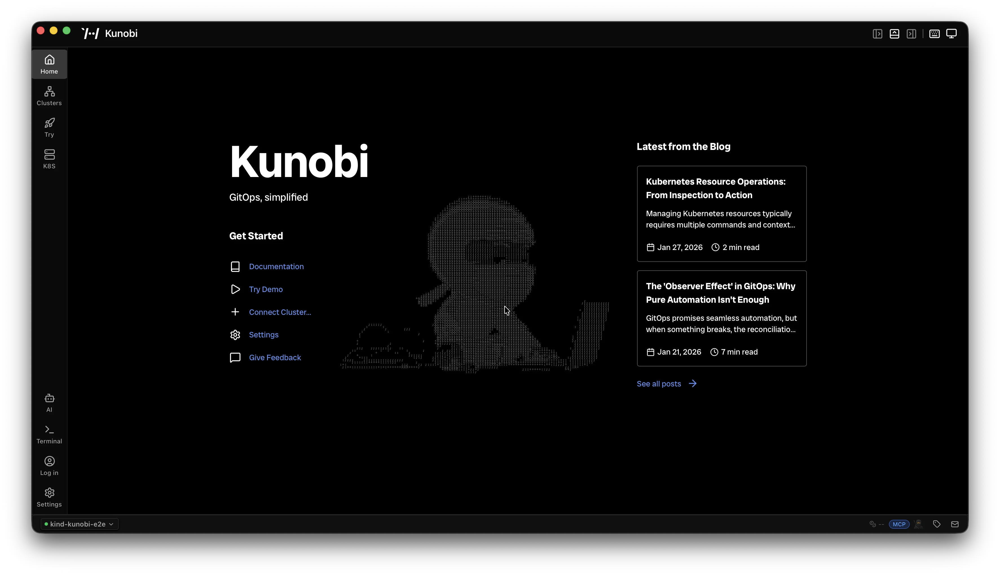
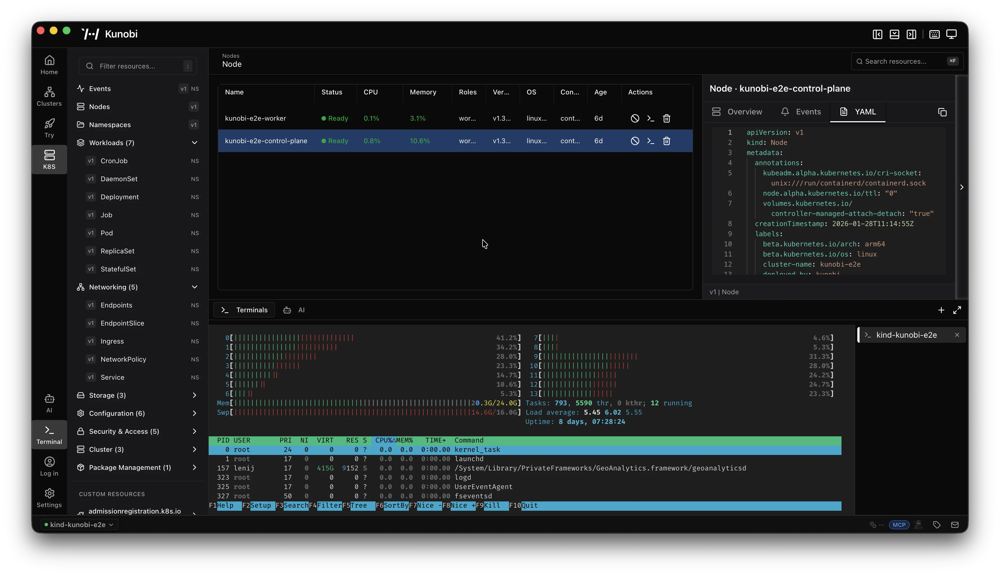
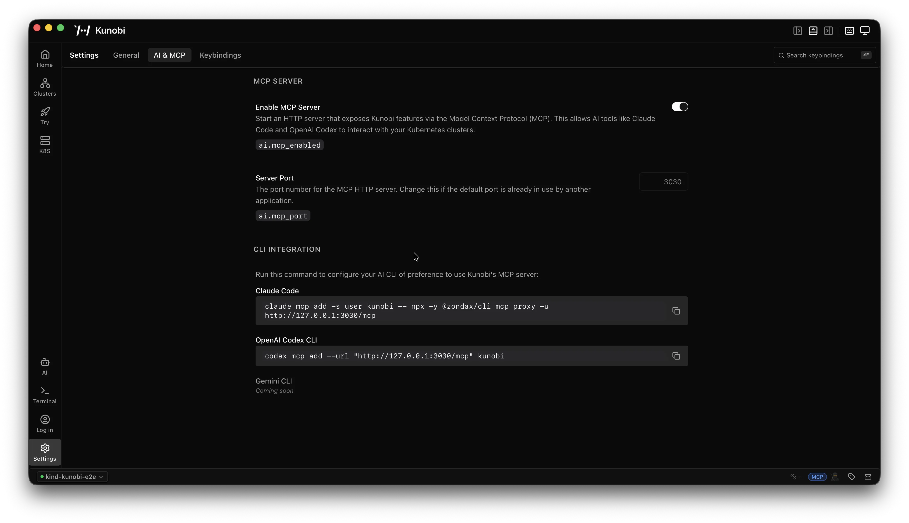

# @kunobi/mcp

MCP bridge to [Kunobi](https://kunobi.ninja), a desktop platform management IDE. AI assistants manage Kubernetes, FluxCD, ArgoCD, and Helm while users maintain real-time visual oversight.



## What is Kunobi?

[Kunobi](https://kunobi.ninja) is a desktop IDE for platform engineering — built with Rust and React, no Electron.

- Real-time cluster visibility with resource browser, YAML editor, and embedded terminal
- Native FluxCD, ArgoCD, and Helm support
- Built-in MCP server for AI assistants (Claude Code, Cursor, Windsurf, Codex CLI, Gemini CLI)
- Available on macOS, Windows, and Linux
- No account required, no cloud dependency



## Setup

Enable MCP in Kunobi under **Settings > AI & MCP**, then install:



### Automatic (recommended)

Register with all your AI clients in one step:

```bash
npx @kunobi/mcp --install
```

This interactively detects your installed AI clients and registers the server with them. Supported clients:

- **Claude Code** — project or user scope
- **Claude Desktop** — user scope
- **Cursor** — project or user scope
- **Windsurf** — project or user scope
- **Codex CLI** — project or user scope
- **Gemini CLI** — project or user scope

To remove the server from all clients:

```bash
npx @kunobi/mcp --uninstall
```

### Manual

If you prefer manual setup, add the following to your client's MCP config:

```json
{
  "mcpServers": {
    "kunobi": {
      "command": "npx",
      "args": ["-y", "@kunobi/mcp"]
    }
  }
}
```

## How it works

```
AI assistant <--stdio--> @kunobi/mcp <--HTTP--> Kunobi variants
                          │
                          ├── keeps one MCP connection per configured variant
                          ├── retries disconnected variants every 5s
                          └── manages one bundler per variant
```

The server keeps a persistent MCP connection for each configured Kunobi variant. When a variant is available, its tools are registered with a `variant__` prefix (e.g., `dev__list_clusters`, `stable__query_store`). When a variant briefly drops, the hub keeps the last-known surface stable while it reconnects in the background. If the disconnect outlives the reconnect grace window, the stale registrations are removed.

### Multi-variant support

Kunobi ships multiple release channels that run on different ports. This MCP server discovers all of them simultaneously:

| Variant  | Default port | Tool prefix    |
|----------|--------------|----------------|
| legacy   | 3030         | `legacy__`     |
| stable   | 3200         | `stable__`     |
| unstable | 3300         | `unstable__`   |
| dev      | 3400         | `dev__`        |
| local    | 3500         | `local__`      |
| e2e      | 3600         | `e2e__`        |

These defaults are auto-generated into `~/.config/kunobi/mcp.json` on first run. You can add custom variants or change ports — see [Configuration](#configuration).

### Built-in tools

These are always available, even when no Kunobi instance is running:

- **`kunobi_status`** — reports all variant connection states, ports, and tool counts
- **`kunobi_launch`** — launches a Kunobi variant by name
- **`kunobi_refresh`** — forces an immediate reconnect attempt across all configured variants
- **`kunobi_call`** — stable entrypoint for variant tools (`variant`, `tool`, `arguments`)

### Recommended calling pattern

Use the stable path below for the most reliable MCP client behavior:

1. Call `kunobi_status`
2. Read `kunobi://tools` to discover full downstream tool schemas and metadata
3. Execute via `kunobi_call(variant, tool, arguments)`

### Dynamic tools

When a Kunobi variant is detected, its tools appear automatically with a variant prefix. For example, if `dev` and `stable` are both running:

- `dev__app_info`, `dev__query_store`, `dev__list_stores`, ...
- `stable__app_info`, `stable__query_store`, `stable__list_stores`, ...

Tools appear dynamically as variants start, and they are withdrawn only after a sustained disconnect — no MCP server restart needed.

These dynamic `variant__tool` entries are still supported, but some MCP clients may not refresh dynamic tool lists reliably. Use `kunobi_call` as the primary path when in doubt.

### Resources

Resources exposed by Kunobi variants are proxied through automatically. When a variant connects, its resources become available to the AI client with variant-namespaced URIs to avoid collisions between multiple running variants.

The server also provides built-in resources:

- **`kunobi://status`** — JSON snapshot of all variant connection states, ports, and capability counts. Supports subscriptions — clients receive `notifications/resources/updated` whenever variants connect or disconnect.
- **`kunobi://tools`** — JSON discovery document listing each variant status plus full downstream tool, resource, and prompt metadata for `kunobi_call`.

### Prompts

Prompts from Kunobi variants are registered with a `variant__` prefix (e.g., `dev__setup_cluster`). They appear and disappear alongside their variant, just like tools.

## Configuration

### Config file

Variant-to-port mappings are stored in `~/.config/kunobi/mcp.json` (auto-generated on first run with defaults). You can edit this file directly or use the CLI:

```bash
# List all configured variants and their connection status
kunobi-mcp list

# Add a custom variant
kunobi-mcp add juan 4200

# Remove a variant
kunobi-mcp remove juan
```

### Environment variables

| Env var | Default | Description |
|---------|---------|-------------|
| `MCP_KUNOBI_RECONNECT_INTERVAL_MS` | `5000` | Reconnect interval in ms |
| `MCP_KUNOBI_VARIANTS` | — | `name:port` pairs to merge (e.g., `juan:4200,test:5000`) |
| `MCP_KUNOBI_AUTO_CONNECT` | `true` | Set `false` to disable automatic background connections. `kunobi_refresh` still works for manual retries. |

Priority: config file defaults → `MCP_KUNOBI_VARIANTS` env var (merges on top).

## CLI

```
kunobi-mcp [command] [options]
```

| Command | Description |
|---------|-------------|
| `list` | Show configured variants and connection status |
| `add <name> <port>` | Add or update a variant |
| `remove <name>` | Remove a variant |
| `install` | Register this MCP server with your AI clients |
| `uninstall` | Remove this MCP server from your AI clients |
| `--help`, `-h` | Show help message |
| `--version`, `-v` | Show version number |
| *(no command, piped)* | Start the stdio MCP server (used by AI clients) |

## Development

```bash
pnpm install
pnpm build
pnpm test
```

For local development against `@kunobi/mcp-bundler`:

```bash
pnpm dev:link    # link local bundler
pnpm dev:unlink  # revert to npm version
```

## License

[Apache-2.0](LICENSE)
